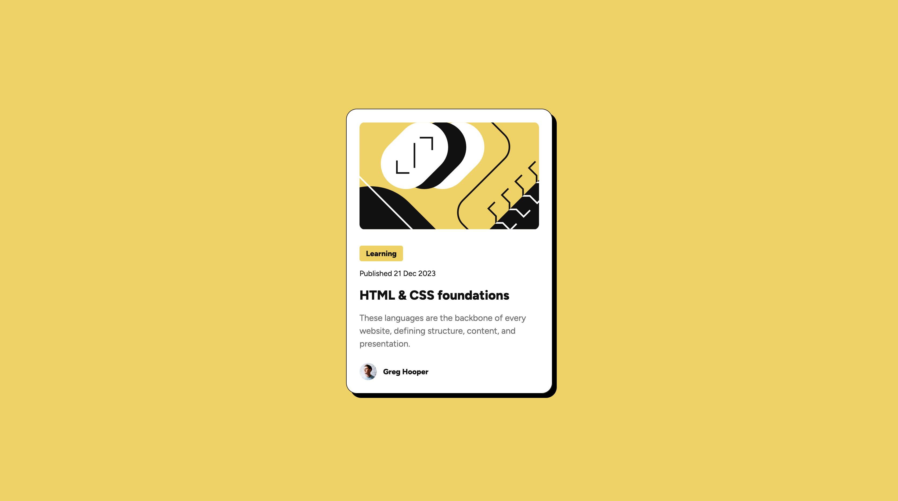

# Frontend Mentor - Blog preview card solution

This is a solution to the [Blog preview card challenge on Frontend Mentor](https://www.frontendmentor.io/challenges/blog-preview-card-ckPaj01IcS).

## Table of contents

- [Overview](#overview)
  - [The challenge](#the-challenge)
  - [Screenshot](#screenshot)
  - [Links](#links)
- [My process](#my-process)
  - [Built with](#built-with)
  - [What I learned](#what-i-learned)
  - [Continued development](#continued-development)
  - [Useful resources](#useful-resources)
- [Author](#author)
- [Acknowledgments](#acknowledgments)


## Overview

### The challenge

Users should be able to:

- See hover and focus states for all interactive elements on the page

### Screenshot



### Links

- Solution URL: [Add solution URL here](https://github.com/willdelorm/blog-preview-card)
- Live Site URL: [Add live site URL here](https://willdelorm.github.io/blog-preview-card/)

## My process

### Built with

- Semantic HTML5 markup
- CSS custom properties
- Flexbox

### What I learned

On this project, I broke the card into 3 sections, header, main and footer, to differentiate the different parts more distinctly.

For my CSS variables, I chose to hold the RGB values themselves instead of the full color. This method feels messier when calling the variable, but it does allow access to the alpha channel more easily.

```css
:root {
  --color-gray-950: 17, 17, 17;
}

body {
  color: rgb(var(--color-gray-950));
}
```

## Author

- Website - [Will Delorm](https://willdelorm.com)
- Frontend Mentor - [@willdelorm](https://www.frontendmentor.io/profile/willdelorm)
